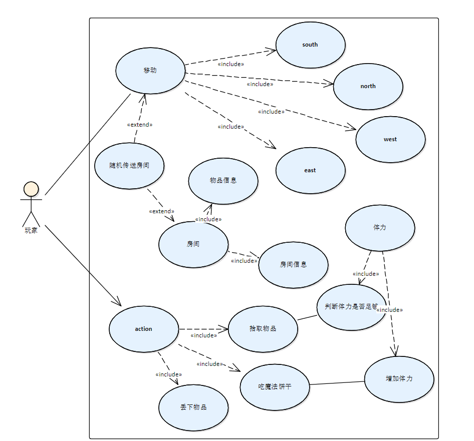
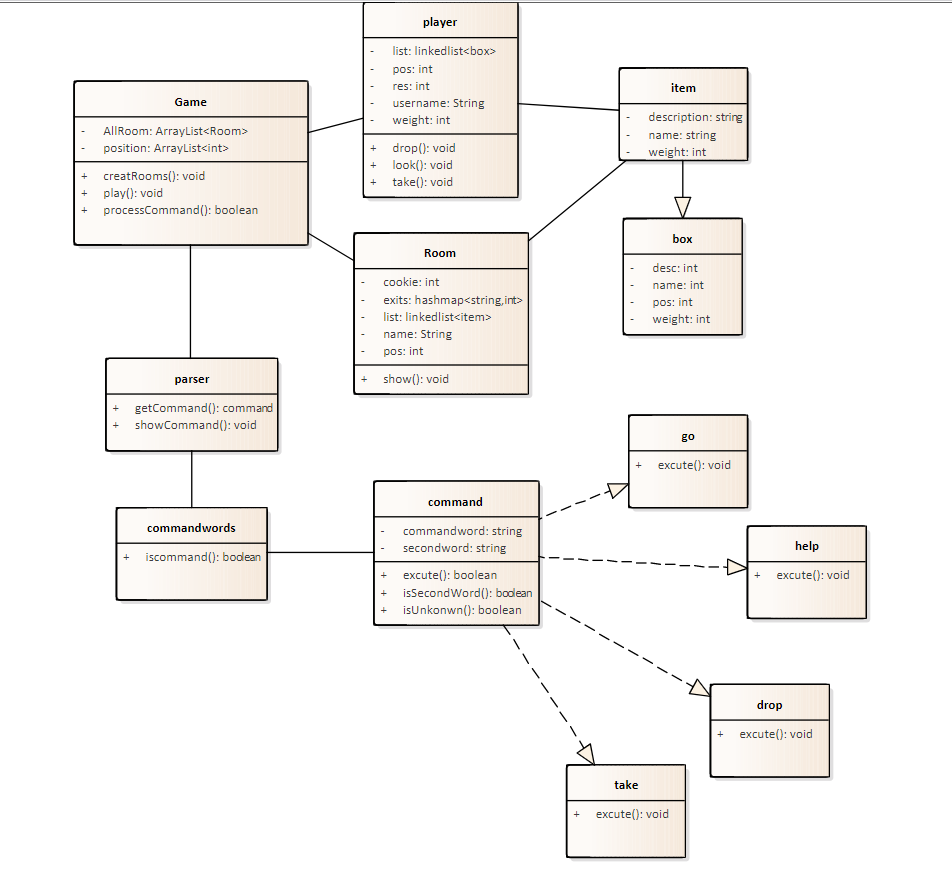

# REPORT

### 1 开发计划

1.阅读和描述样例工程—理解程序的含义和实现过程。

2.标注样例工程中的代码—添加代码注释。

3.扩充和维护样例工程—找出程序设计不合理的地方，对错误进行修正。

4.功能扩充—扩充程序功能
      4.1物品功能—房间内添加物品且显示物品
      4.2回溯功能—此功能可以回溯到上一个房间，最多回到起点
      4.3传送功能—游戏中添加一个能够传送的房间，每次到达这里后被随机传送到其它的房间
      4.4 player—保存玩家信息，实现存取物品的功能，保证拾取的物品不会超过player的负荷。
      4.5 cookie—在某个或某些房间中随机增加一个magic cookie（魔法饼干）物件，并增加一个“eat cookie”命令，如果玩家找到并吃掉魔法饼干，就可以增长玩家的负重能力；

5.增加了图形界面，使用按钮即可实现上述各种功能，不必再输入复杂了文字命令。

6.设计并实现了数据库，将数据保存到数据库中，可以从数据库中读取数据。

### 2.用例图和类图

**用例图**：

**类图**

​           

 

### 3 软件配置计划

#####   （1）源代码文件及版本的命名规范

源代码文件：

规范1：要从名字体现出代码的“功能”

规范2：不要用缩写

规范3：不要全用大写字母

规范4：需要分割的时候用首字母大写进行分割

 

版本命名：主版本号、次版本号。

主版本号一般代表了系统作的重大的功能或者架构变更，比如说v 1和v 2，在架构上已经两样了。主版本号从1计数,递增加1，本次实验中未进行重大的功能或者架构变更，所以主版本号始终为1。

次版本号表示较大范围的功能增加和变化，及Bug 修复，但没有架构的变化,比如说v 1.2版本, 标注了样例工程中的代码；v 1.4版本, 添加了许多功能。次版本号也是从1计数,递增加1。由于中间部分版本变化不大，未创建分支。

 

##### （2）分支管理规范

Git 分支类型

master 分支（主分支） 稳定版本

feedback 分支（备份分支） 备份版本

v1.0 分支（初始分支）  标注样例工程中的代码版本

v1.1 分支（开发分支）  功能扩充版本

v1.2 分支（开发分支）  功能扩充版本

v1.3 分支（开发分支） 功能扩充版本

v1.4 分支（开发分支）  功能扩充版本

 

##### （3）提交规范

标题行: 必填, 描述主要修改类型和内容

主题内容: 选填，描述为什么修改, 做了什么样的修改, 以及开发的思路等等

### 4.功能设计

* Go命令，Go直接调用hashmap来获得对应Exits的房间。

* Back命令，将走过的房间放入栈中，back时每次弹出栈顶即可。

* 随机传送门，根据当前时间生成随机数，然后每次进入传送门的时候就根据当时产生的随机数跳转到对应的房间即可。

* Take命令，要完成能够拿物品的功能，首先我们需要将物品抽象出box类，而房间的物品存放在列表中抽象出goods类，根据房间编号将goods对象依次存放在Vector<goods>中即可，接下来完成玩家的设计，玩家拿的东西要放在自己的背包中，设置一个玩家的goods表示背包即可，玩家类应有玩家的基本信息和背包的容量等操作，那么每次take时，将对应房间的goods中的box放入玩家的goods中即可，由于存在多次的增加和删除(拿东西和放东西)，故goods类对物品的存储采用链表实现。

* Drop命令，和take命令实现原理相似，不同的是把玩家背包的东西放入对应房间的goods中。

* Cookie，cookie可以抽象为一个物品，也可以作为一个特殊标识，他的重量为0，当玩家take 它的时候，调用玩家类中的函数将其背

包容量增大一点即可，同时cookie将消失。

*   数据库：
    * player表记录用户的id、name、所在房间、背包容量、现在重量
    * room表记录房间的id，name，description。
    * box表记录物品的id，name，weight、description，以及所在房间（必须存在于房间表中）

*   窗口界面：

    * 中间一个图片代表背景，然后将小人放置在背景中间。

    * 四周放四个按钮代表四个方向，按下即代表走向那个方向。
    * 上方放一个列表，代表房间内的物品。
    * 图片上放一个jlabel用来给出游戏的信息。
    * 左上角加入help和about
    * 右上角加入back按钮，按下就回退一个房间
    * 加入save按钮，实现保存功能，存在数据库中。
    * 最左边加入switch，切换房间和背包的视图。
    * 最右边加入take，当切换到背包时变为drop

### 5测试计划

* 移动返回功能测试，先进行一系列的移动再返回看移动和返回路径是否正确。

* 随机房间，多次测试，查看是否为真随机。

* 数据库测试

* 测试放下物品和吃魔法饼干升级背包。

* player功能，测试player的各个功能。

  * 测试走到有物品的房间拿物品。
  * 测试物品拿太多了背包装不下。

  

### 6 任务分配

| 任务                         | 负责人 | 开发时间            | 是否完成 |
| ---------------------------- | :----- | ------------------- | -------- |
| go功能的实现                 | 彭智毅  | 2022/5/15-2022/5/16 | 是       |
| back功能的实现               | 彭智毅  | 2022/5/16-2022/5/17 | 是       |
| go&back的测试                | 彭智毅  | 2022/5/16-2022/5/17 | 是       |
| look功能的实现               | 彭智毅  | 2022/5/17-2022/5/18 | 是       |
| player的设计                 | 彭智毅  | 2022/5/17-2022/5/18 | 是       |
| take功能的实现               | 陈庞   | 2022/5/17-2022/5/19 | 是       |
| drop功能的实现               | 陈庞   | 2022/5/17-2022/5/19 | 是       |
| take&drop的测试              | 陈庞   | 2022/5/20-2022/5/20 | 是       |
| cookie功能的实现             | 彭智毅 | 2022/5/18-2022/5/19 | 是       |
| 窗口界面原型设计             | 陈庞   | 2022/5/20-2022/5/22 | 是       |
| 窗口界面基本功能的实现       | 陈庞   | 2022/5/22-2022/5/27 | 是       |
| help和about功能等message box | 陈庞   | 2022/5/27-2022/5/29 | 是       |
| 保存数据和读取数据的实现     | 陈庞   | 2022/6/1-2022/6/5   | 是       |
| 数据库的设计                 | 杨帆   | 2022/5/29-2022/5/31 | 是       |
| 游戏素材的设计和添加         | 杨帆   | 2022/5/20-2022/5/22 | 是       |
| 数据库测试                   | 杨帆   | 2022/6/6-2022/6/7   | 是       |
|REPORT.md                    |陈庞    |2022/6/10-2022/6/20  |是      |      
| ppt                          | 杨帆   | 2022/6/10-2022/6/20 | 是       |
| 演示验收                     | 彭智毅 | 2022/6/26-2022/6/27 | 正在进行 |      |

